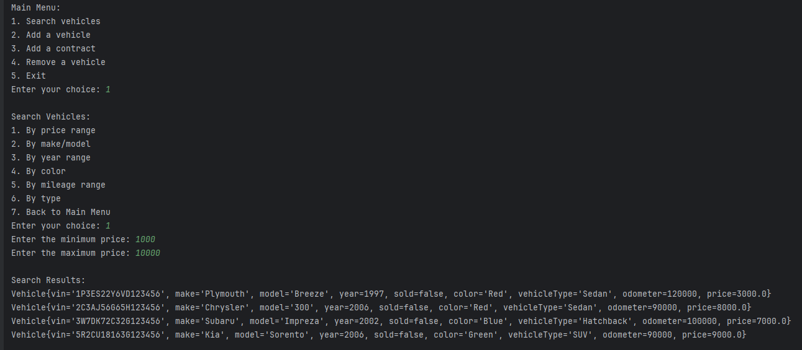
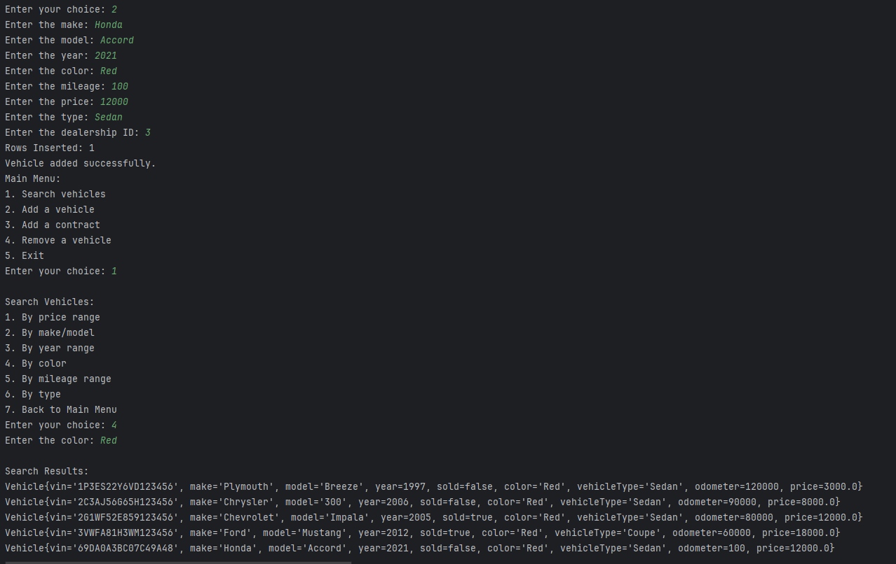
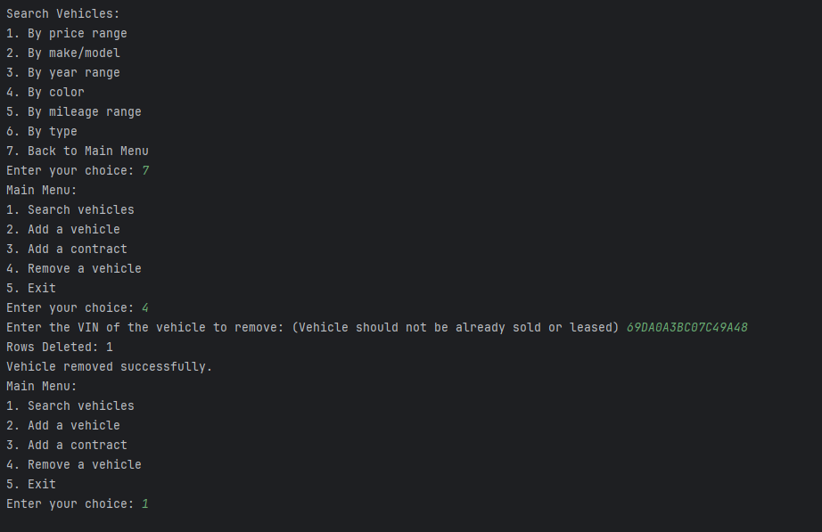
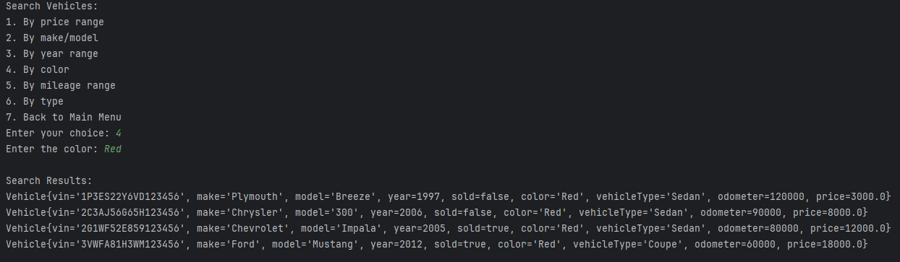

# Dealership Workshop

## Description of the Project

This program allows users to browse available vehicles, add new vehicles, remove vehicles, and view the full dealership inventory.
All vehicle data is stored in a text file so that information remains saved even after the program is closed.
## User Stories

- As a user, I want to add a new vehicle to the dealership inventory, so that I can keep the system updated with the latest available cars.
- As a user, I want to remove a vehicle from the inventory, so that I can keep the system accurate when a car is sold or no longer available.
- As a user, I want to search for vehicles by different filters (such as make, model, price, or year), so that I can quickly find cars that meet my needs.
- As a user, I want to lease a vehicle through the system, so that I can generate a lease contract and track leasing details easily.

### Prerequisites

- IntelliJ IDEA: Ensure you have IntelliJ IDEA installed, which you can download from [here](https://www.jetbrains.com/idea/download/).
- Java SDK: Make sure Java SDK is installed and configured in IntelliJ.

### Running the Application in IntelliJ

Follow these steps to get your application running within IntelliJ IDEA:

1. Open IntelliJ IDEA.
2. Select "Open" and navigate to the directory where you cloned or downloaded the project.
3. After the project opens, wait for IntelliJ to index the files and set up the project.
4. Find the main class with the `public static void main(String[] args)` method.
5. Right-click on the file and select 'Run 'YourMainClassName.main()'' to start the application.

## Technologies Used

- Java: Mention the version you are using.
- Any additional libraries or frameworks used in the project.

## Demo

## Resources

- Potato Sensei

## Thanks

- Thank you to Raymond Maroun for the skeleton code.
